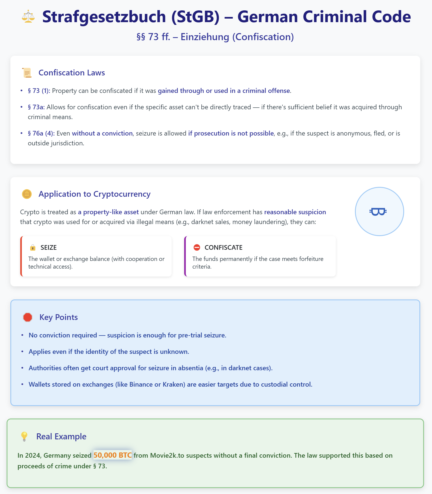

# German Criminal Code - Crypto Confiscation Animation

An interactive guide explaining crypto confiscation under the German Criminal Code.



## Features

- **Zero Dependencies**: Pure HTML, CSS, and vanilla JavaScript
- **Works Offline**: No internet connection required after download
- **Cross-Browser Compatible**: Works in all modern browsers
- **Auto-Advancing Slides**: Cycles through sentencing guidelines automatically
- **Interactive Navigation**: Manual control through navigation dots
- **No Installation Required**: Just download and open in any browser

## German Criminal Code Concepts Covered

1.  **Legal Basis** - Section 73d of the German Criminal Code
2.  **Confiscation of Crypto Assets** - Conditions for confiscation
3.  **Valuation of Crypto Assets** - Determining the value for confiscation

## Getting Started

### Method 1: Direct Download
1. Download the HTML file: `german-crypto-confiscation-html.html`
2. Double-click the file to open it in your default browser
3. That's it!

### Method 2: Clone the Repository
```bash
git clone https://github.com/DoingFedTime/VideoThings/German-Criminal-Code---Crypto-Confiscation-Animation.git
cd German-Criminal-Code---Crypto-Confiscation-Animation
```
Then open `german-crypto-confiscation-html.html` in any browser.

## Customization

The animation is easily customizable:

- **Content**: Modify the HTML `<div class="slide">` elements to change titles and descriptions
- **Timing**: Adjust the timer interval in the JavaScript (currently set to 5000ms)
- **Colors**: Change the CSS classes for each slide (.slide-1, .slide-2, etc.)
- **Icons**: Replace emoji icons with your preferred symbols

## Usage Rights

Feel free to:
- Share this animation
- Use it for educational purposes
- Modify it for your own projects

## Live Demo

Check out the live demo [here](https://doingfedtime.github.io/German-Criminal-Code---Crypto-Confiscation-Animation).

## Author

Created by [DoingFedTime](https://github.com/DoingFedTime)


