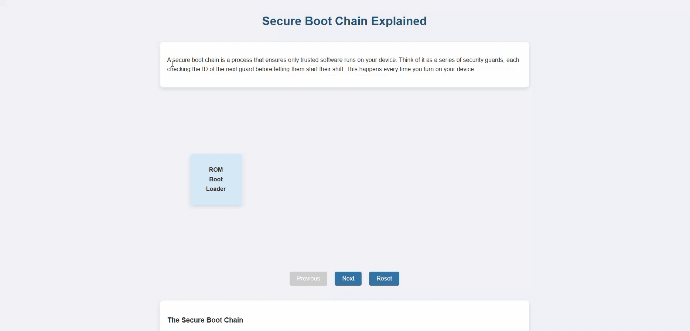

# Secure Boot Chain Explained

This directory contains an interactive HTML file (`secure-boot-chain.html`) that visually explains the concept of a secure boot chain. The HTML file provides a step-by-step breakdown of how a secure boot process works, from the initial ROM Boot Loader to the loading of applications and services, emphasizing the "chain of trust" established through cryptographic verification at each stage.

## Visual Representation

The following GIF provides a visual overview of the secure boot chain process:



## How it Works

The `secure-boot-chain.html` file uses HTML, CSS, and JavaScript to create an interactive visualization. Users can click "Next" and "Previous" buttons to step through the different stages of the boot chain and read explanations for each step. The visualization highlights each stage and the verification process between them.

## Files

- `secure-boot-chain.html`: The main HTML file containing the interactive explanation.
- `secureboot.gif`: A GIF illustrating the secure boot process.
- `README.md`: This file.

## How to Download

To download this project, you can clone the entire repository using Git:

```bash
git clone https://github.com/DoingFedTime/VideoThings.git
```

Once cloned, navigate to the `web tracking/Secure Boot Chain` directory to access the files.

Alternatively, you can download the files directly from the GitHub repository page by clicking the "Code" button and selecting "Download ZIP".