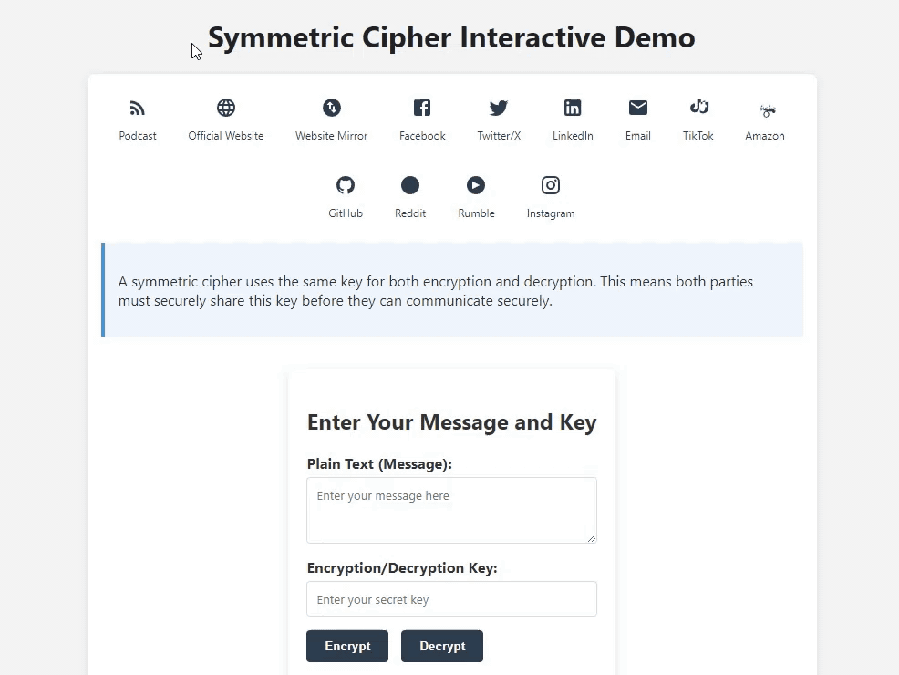

# Symmetric Cipher Interactive Demo

An interactive demonstration of a symmetric cipher using XOR encryption.

## Features

- **Interactive Encryption/Decryption**: Enter a message and key to encrypt or decrypt.
- **Simple XOR Cipher**: Uses a basic XOR cipher for demonstration purposes.
- **Client-Side Implementation**: Encryption and decryption are performed in the browser using JavaScript.
- **Zero Dependencies**: Pure HTML, CSS, and vanilla JavaScript.
- **Clear Visualization**: Demonstrates the encryption and decryption process with a diagram.
- **Educational**: Helps users understand the basic principles of symmetric encryption.

## Getting Started

1.  Download the HTML file: `symmetric-cipher-demo.html`
2.  Double-click the file to open it in your default browser.
3.  Enter your message and key in the provided fields.
4.  Click the "Encrypt" button to encrypt the message.
5.  Click the "Decrypt" button to decrypt the message.

## Customization

The demo is easily customizable:

-   **Encryption Algorithm**: Modify the JavaScript functions `xorEncrypt` and `xorDecrypt` to implement different encryption algorithms.
-   **Styling**: Change the CSS styles to customize the appearance of the demo.
-   **Social Media Links**: Update the social media links in the footer.

## Usage Rights

Feel free to:

-   Share this demo
-   Use it for educational purposes
-   Modify it for your own projects

## Author

Created by [DoingFedTime](https://github.com/DoingFedTime)

---

No frameworks. No dependencies. No bullshit.
