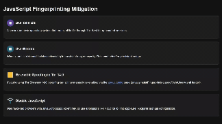

# Tor Browser Anti-Leak Options

An interactive guide to understanding and mitigating OS leaks in the Tor Browser.



## Features

- **Zero Dependencies**: Pure HTML, CSS, and vanilla JavaScript
- **Works Offline**: No internet connection required after download
- **Cross-Browser Compatible**: Works in all modern browsers
- **Interactive Content**: Demonstrates OS leak mitigation techniques
- **No Installation Required**: Just download and open in any browser

## Concepts Covered

1.  **OS Leaks**: How your operating system can reveal your identity
2.  **Tor Browser Configuration**: Settings to enhance privacy
3.  **JavaScript Fingerprinting**: Understanding and blocking fingerprinting techniques

## Getting Started

### Method 1: Direct Download
1. Download the HTML file: `dealing with os leak in tor browser.html`
2. Double-click the file to open it in your default browser
3. That's it!

### Method 2: Clone the Repository
```bash
git clone https://github.com/DoingFedTime/VideoThings/Tor-Browser-anti-leak-options.git
cd Tor-Browser-anti-leak-options
```
Then open `dealing with os leak in tor browser.html` in any browser.

## Customization

The content is easily customizable:

- **Content**: Modify the HTML elements to change titles and descriptions
- **JavaScript**: Review the JavaScript code for fingerprinting techniques
- **CSS**: Change the CSS classes for styling

## Usage Rights

Feel free to:
- Share this guide
- Use it for educational purposes
- Modify it for your own projects

## Author

Created by [DoingFedTime](https://github.com/DoingFedTime)

---

<div align="center">
  <sub>No frameworks. No dependencies. No bullshit.</sub>
</div>